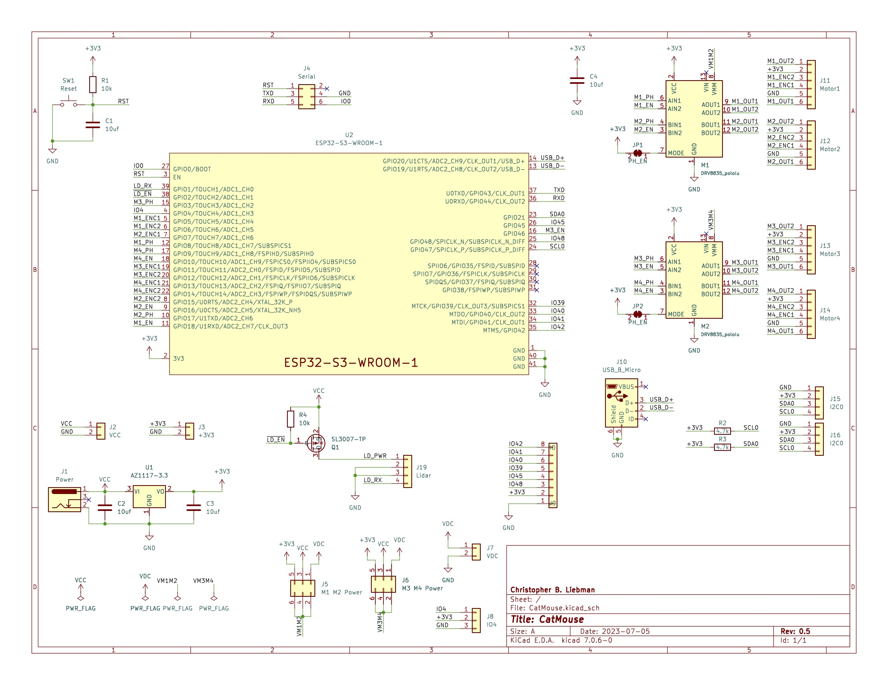

# Prototype Rover

Simple autonomous differential drive rover with LIDAR in RUST using an ESP32s3.

- [motor](motor) contains a simple PWM motor control for cheap brushed motors using a phase/enable type motor controller.
- [encoder](encoder) contains a PCNT based quadrature encoder controller to track the position of the encoder.
- [speed-control](speed-control) implements PID control of motor speed using encoder.
- [position-control](position-control) allows the motor position to be controlled by specifying the wanted position in degrees.
- [wheel](wheel) is an abstraction on top of position-control to specify motor position in millimeters.
- [differential-drive](differential-drive) implements rover rotation and forward/reverse movement by specifying the distance or rotation.
- [lidar](lidar) implements LIDAR with an inexpensive LD19 based Lidar like <https://www.amazon.com/dp/B0B1V8D36H>
- [rover](rover) runs around autonomously avoiding things.

